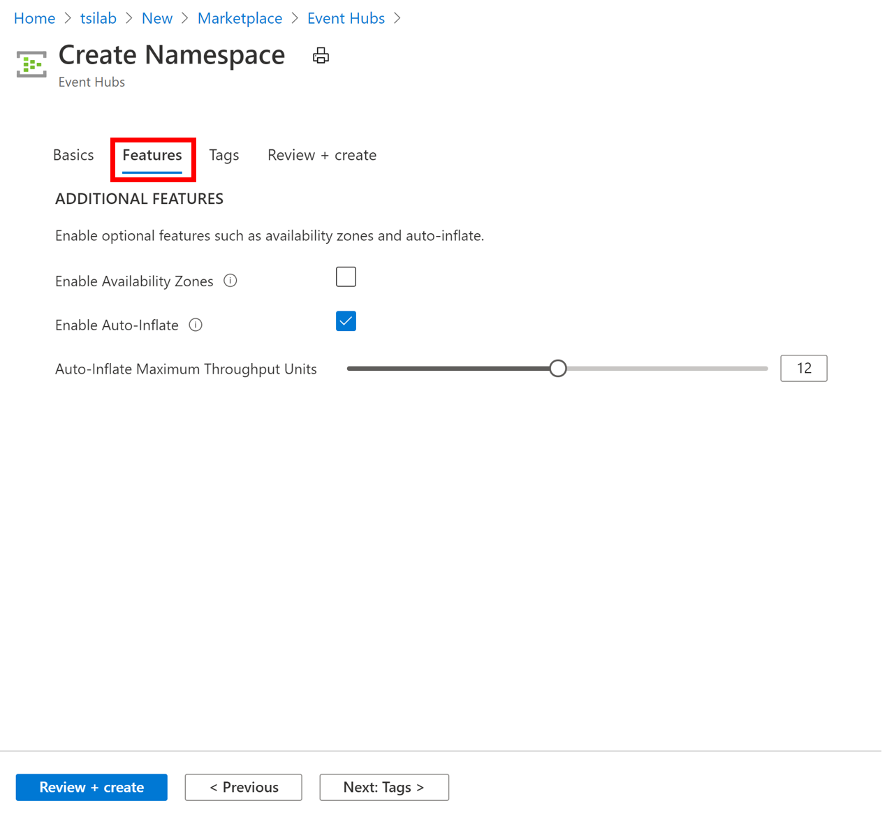

## Step 1: Event Hub Set-Up and Device Simulation

Azure IoT Time Series Insights preview supports both IoT Hub and Event Hubs as event sources. In this lab we'll be setting up an Event Hub and leverage a SPA client to generate and push wind mill sensor data to the hub.

### 1. Create a resource group

1. Create a new Azure resource group (RG) to collect and manage all the application resources we will be provisioning and using during the lab and for ease of resource clean-up post lab. If you prefer, you can also re-use an existing RG and skip this step. 
\

2. Click on **+ Add** button  
\

3. Enter a **Resource group name** and select a **subscription** and **region**. 
4. Click on **Review + Create** to double check your entries. Once you are done reviewing, click on **Create**.
\

### 2. Create an Event Hubs namespace and an Event Hub

TSI preview supports both Azure IoT Hub and Events Hubs as event sources. Up to two event sources are permitted per TSI environment. In this lab we will use an Event Hub as our event source.

1. Navigate to your resource group and click "Add" to create an Event Hub resource. (You can also click the tool bar on the upper left hand corner of the Azure portal and select "Create a resource".)
\

2. Search the marketplace for "Event Hubs" and click create.

3. First you create the hub namespace, then you will instantiate a hub that will receive data. Fill out the form for creating a namespace with the following parameters:

**Parameter**|**Action**
-----|-----
Subscription|Select the subscription you're using for the lab.
Resource group|Select the RG you created from the previous step.
Namespace Name |Enter a unique name for the Event Hubs Namespace.
Location|Select your RG location. Note that as a best practice it's recommended to house your event source and TSI environment in the same location.
Pricing tier|Select Standard (20 Consumer groups, 1000 Brokered connections).
Throughput Units|Enter 4.

4. Under the Features tab, enable auto inflate and set the following parameters: 
  
**Parameter**|**Action**
-----|-----
Enable Auto-Inflate|Check the checkbox to enable.
Auto-Inflate Maximum Throughput Units|Slide to 12 units.

5. Once your deployment is complete, navigate to your Event Hubs Namespace and click on Event Hubs:
\

6. Create an Event Hub with a Parition Count of 4. Leave all other defaults as is. 
\

7. Click on your newly created Event Hub to update its settings.
\

8. You will need to generate a connection string to enable both sending and reading hub telemetry messages. Creating both a Send and Listen policy follows the principle of least privilege. Click on Shared access policies to create them.
\

9. Create both a Send policy as well as a Listen policy. Here's an example of how to create a send policy:
\

10. Click on the newly created Send policy and copy the "Connection string–primary key" to your clipboard. 
\

11.  Open [the TSI Sample Wind Farm Pusher](https://tsiclientsample.azurewebsites.net/windFarmGen.html) in a separate browser window. Paste the connection string into the input field in the TSI Sample Wind Farm Pusher. The default values in the other fields are generic settings - you can edit these, if you'd like to. Please keep this tab open as the simulator will continue to push data until the browser tab is closed.
\

12.  After clicking start a JSON file will be downloaded. This file has the simulated time series' data model and we will use it in a future step to bulk-edit our time series instances.

13. Navigate back to your Event Hub, the metrics on the overview tab should now show data flowing into the hub:

14. Continue on to the [next step](../step-02-tsi-env-creation) to create a TSI environment.

