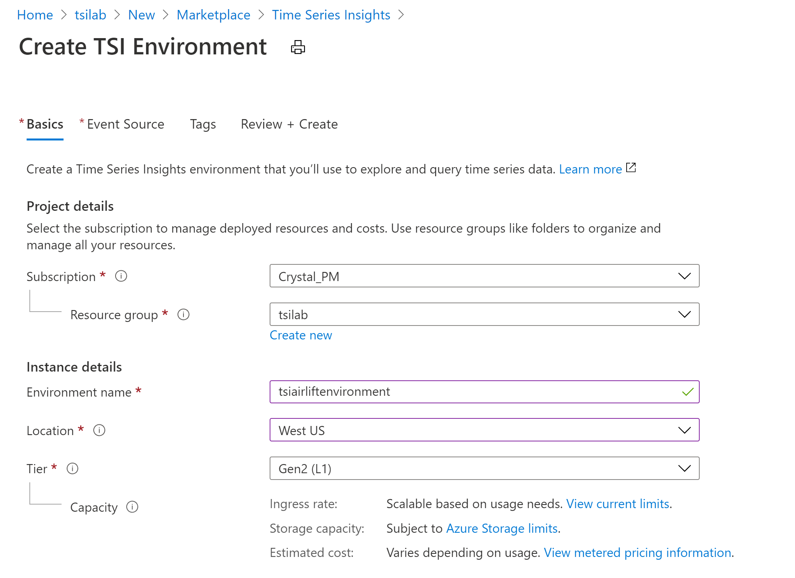

## Step 2: Create an Azure Time Series Insights environment

1. Navigate back to the resource group and add another resource. Search the Azure marketplace for "Time Series Insights". Click create and configure your TSI environment similar to the image below. See the table below the images for more details on each input field.
\

\

**Parameter**|**Action**
-----|-----
Subscription and Resource Group|Choose the same subscription and resource group as your Event Hub.
Environment name|Enter a unique name for the Azure Time Series Insights environment.
Location|Select a datacenter region for your Azure Time Series Insights environment. To avoid additional latency, it's best to create your Azure Time Series Insights environment in the same region as your IoT or Event Hub created in the previous step.
Tier|Select Gen2 (L1). This is the SKU for the Azure Time Series Insights Gen2 product.
Time Series ID Property name|Enter "Id" as this is the TSID used by the data simulator. Note that the value you select for your TS ID is immutable. You can't change it later.
Storage account name|Enter a globally unique name for a new storage account. Leave other storage related defaults the same.
Data Lake Storage Gen2|Leave as disabled.
Enable Warm Store|Select Yes to enable warm store.
Data Retention (days)|Choose the default option of 7 days.

2. Click on “Next: Event Source” to establish a connection between your Event Hub and TSI:

**Parameter**|**Action**
-----|-----
Create an event source?|Select Yes.
Source type|Select Event Hub.
Name|Enter a unique value for the event source name.
Subscription|Select the subscription that you're using for the lab.
Event Hub namespace|Select the namespace created in Step 2.
Event Hub name|Select the hub created in Step 2.
Event Hub access policy name|Select the name of the Listen policy created in Step 2. 
Event Hub consumer group|Select $Default. Note that if you intend to Listen via another app or service you should have unique consumer groups for each listener.
Timestamp property|Enter "Timestamp". This value is used to identify the Timestamp property in your incoming telemetry data. 

3. Click on “Review + create,” review the values entered and click “Create”.

4. It will take up to a couple of minutes for your deployment to complete. When ready, navigate to your new Time Series Insights resource!
\

 
5. In the overview pane you will see the link to your TSI explorer, the user-interface that ships with your PaaS. Click on your explorer URL. 
\

6. Coming to your TSI explorer, your default view should look similar to the image below:

7. Continue to the [next step](../step-03-explorer-intro) for an overview of the explorer.

