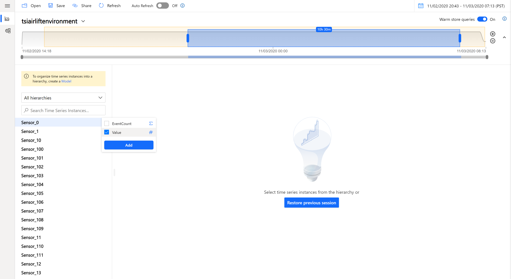

## Step 3: Azure Time Series Insights Explorer Overview

### Explorer Overview
Welcome to the explorer! Some of the key features include:

1. Availability Panel: You can select a different time range by dragging the handles of the availability picker or using the date-time selector in the top right corner. You can expand the bar to see the volume of data over time, or keep it collapsed for a slimmer look. Any time selection that is within the orange area will query your Time Series Insights environment’s Warm Store. Selecting a time range outside of the orange region will query the environment's Cold Store. 
\

2. Hierarchy Panel: On the left, you’ll see the Time Series Model (TSM) hierarchy. Time series that are not yet configured to a hierarchy will fall under the default of “Unassigned Time Series Instances". All your instances are unassigned at the moment. We will create hierarchies in the next step.
\

1. Charting Panel: In the middle of the page is the charting pane where you can visualize events and perform analysis. Below the charting pane is the well which offers additional settings such as time shift and step interpolation. Try charting a time series by clicking on a sensor from the hierarchy panel, selecting a variable and clicking Add:
\

4. Read more about the [TSI Explorer features](https://docs.microsoft.com/azure/time-series-insights/concepts-ux-panels).
 
5. Continue on to the [next step](../step-04-tsm-creation/README.md) to create a data model.
