## Step 4: Create a Time Series Model

In this section, you will add time series model entities to contextualize your IoT data. Time Series Model (preview) has 3 components: Types, Hierarchies and Instances.

* Types allow users to define calculations, aggregates, and categories over raw telemetry data, as well as define a tag for the sensor (example: Temperature sensor, Pressure sensor). This is achieved by authoring type variables.
* Hierarchies allow users to specify the structure of their assets. For example, an organization has buildings and buildings have rooms which contain IoT devices. We will leverage the ability to create multiple hierarchical views to see the Contoso Wind Farm data organized in both a physical and sematic structure.
* Instances enrich incoming IoT data with device metadata. An instance links to 1 type definition and multiple hierarchy definitions.

### 1. Create hierarchies

1. In the upper left part of the explorer select the Model tab:
\
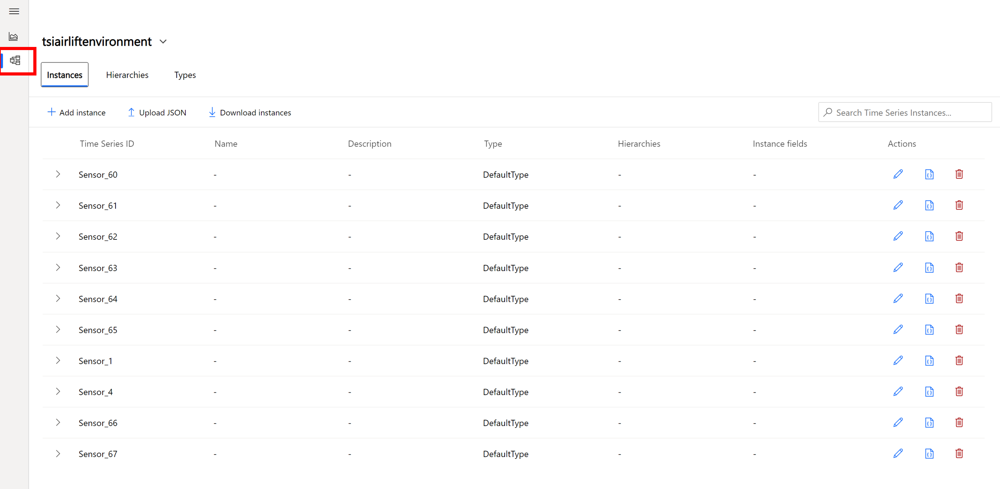

2. In the Hierarchies section, select “+ Add”. Create a hierarchy named "Wind Farm - Physical" with the following levels: Location > Windmill > Group > Name. It should look like this:
\
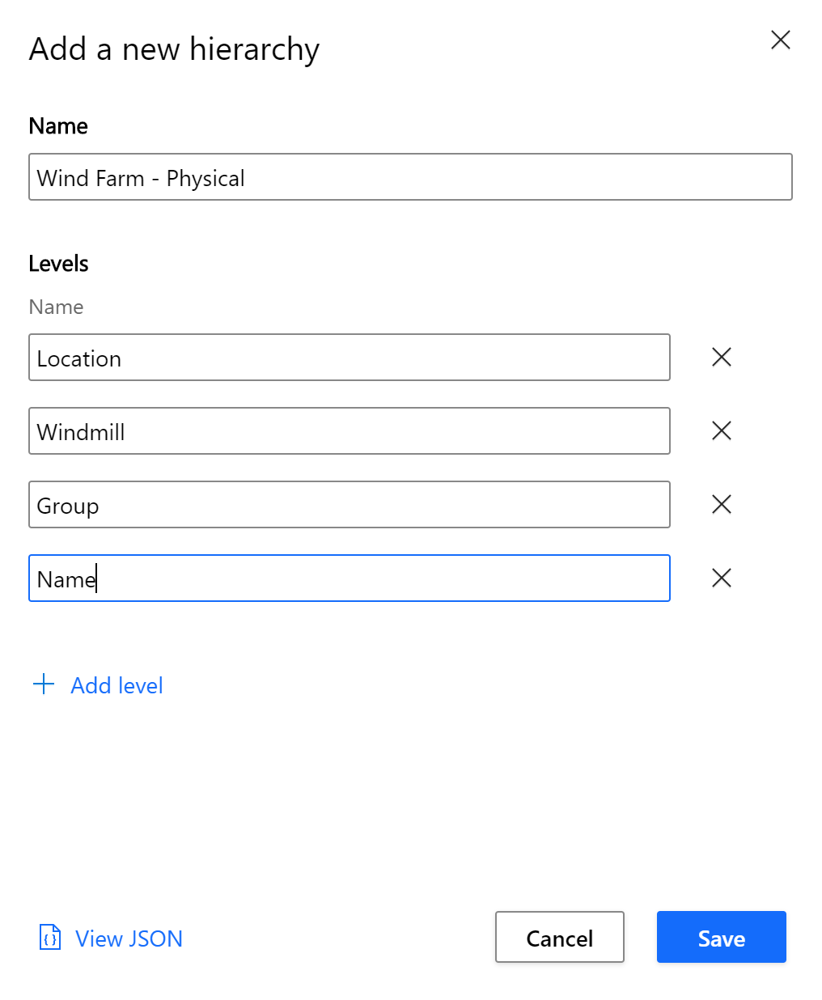

3. Click Save. If you don't see the hierarchy listed refresh the page. 

4. Repeat the steps above to add another hierarchy named "Wind Farm - Semantic" with the following levels: Group > Name > Location > Windmill. It should look like this:
\
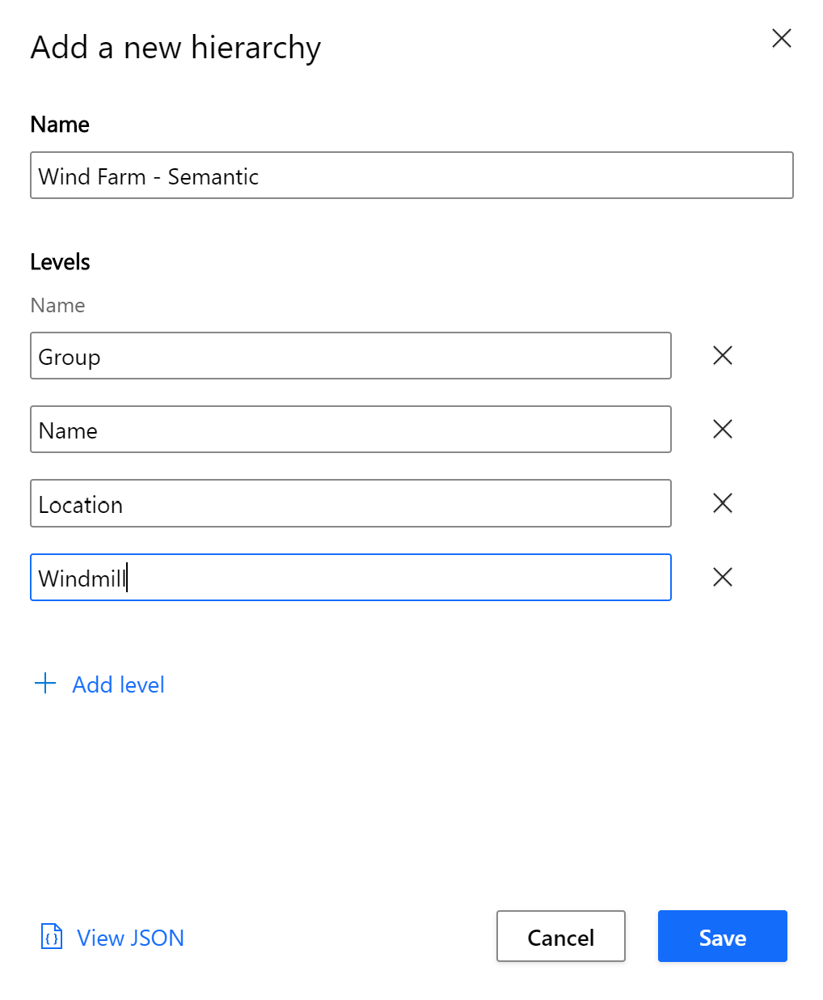

5. Click Save. 
   
### 2. Create Variables

1. Now that there are two hierarchies navigate to the Types section. For the lab we will be adding variables to the default type. Click the pencil icon to open the editor, and select the Variables tab. Click "+ Add variable" and enter the following fields:

**Field**|**Value**
-----|-----
Name|"Value Variable"
Kind| "Numeric"
Value| Select from preset. From the drop-down menu select "Value (Double)".
Advanced options| We will not be using the advanced variable options, however, you can expand the section to view the options offered, including modifying the aggregation and configuring interpolation or a value filter.

\
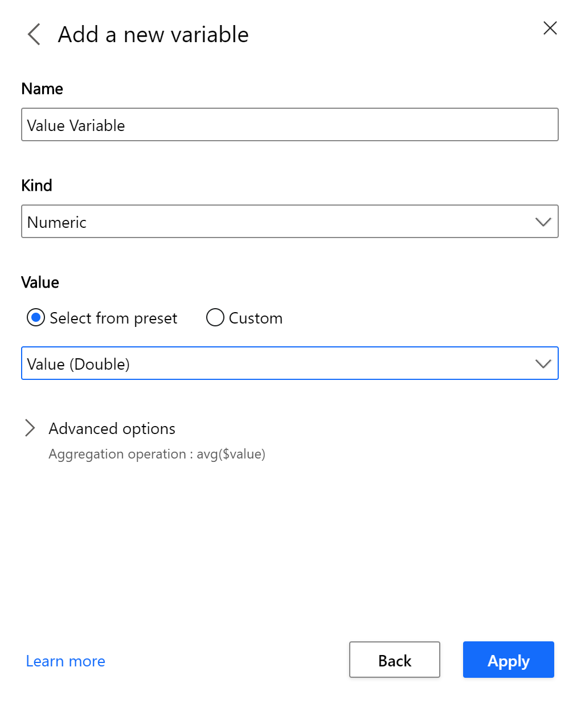

2. Click "Apply". 
   
3. Next we will add another Numeric variable and edit some of the advanced options to allow for interpolation. Click "+ Add variable" and enter the following fields:

**Field**|**Value**
-----|-----
Name|"Time Weighted Value Variable"
Kind| "Numeric"
Value| Select from preset. From the drop-down menu select "Value (Double)".
Advanced options > Aggregation operation| From the drop-down menu select "TWAVG" to perform a time-weighted average aggregation. 
Advanced options > Interpolation|Interpolation will be required for this type of aggregation. Select "Linear". Leave all other settings as is. 

\
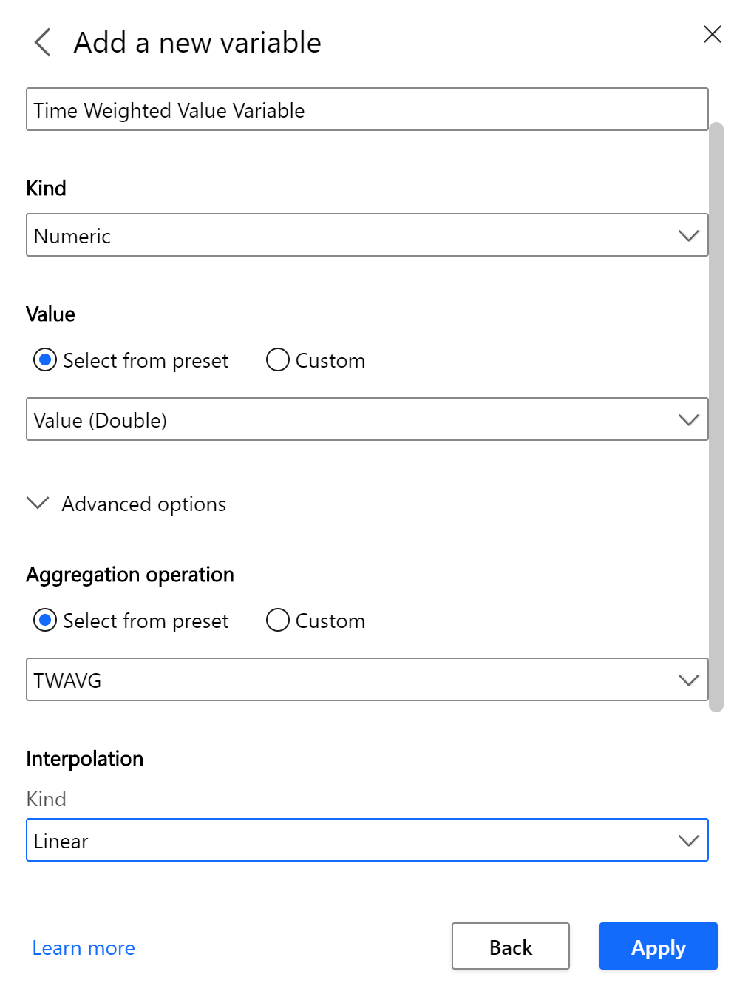

4. Click "Apply". 
   
5. Next we will add a categorical variable. Categorical variables allow you to set a descriptive label or category to a discrete value. For example, 0 or 1 might be sent in an event payload, but an operations manager may instead prefer to see "On" and "Off" in the explorer.Click "+ Add variable" and enter the following fields:

**Field**|**Value**
-----|-----
Name|"Status Variable"
Kind|"Categorical"
Value|From the drop-down, select "Status (String)"
Categories| Create a Label called "Machinery Working" and map it to the value "Good". Create another label called "Machinery Not Working" and map it to "Bad". Select colors to represent these values. 
Default Category| Name your default category "Unknown" and choose a color to represent it. 

\
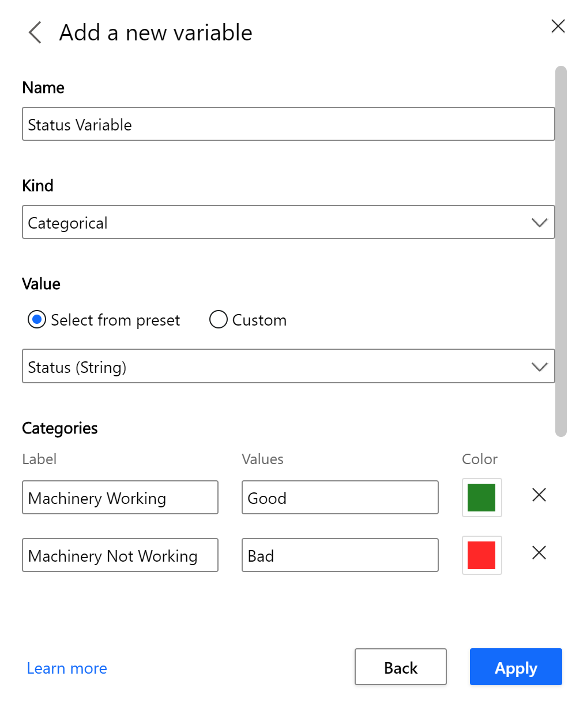

6. Click Apply and then click Save.

### 3. Update Instances

We will be using the bulk-upload feature to create a time series instance for each of the 111 sensors, assign the default type, and add then to both of the hierarchies. This segment will include some copy and pasting. Please use any text editor of your choice for editing JSON, we recommend VS Code.

1. **Make a copy** of the Instances.json file that was downloaded by the data simulator to edit.
   
2. Navigate back to the explorer and copy the Type ID of the Default Type:
\
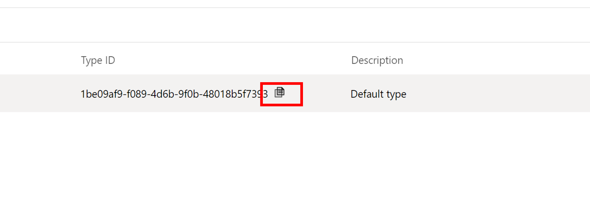

3. In the Instances.json file, find and replace all instances of "tTBD" with the GUID, being sure that the ID is enclosed in just one pair of ""

4. Next we will copy the two GUIDs of both hierarchies and use another text editor to get them into following format: "GUID", "GUID"

5. In the explorer click on the Hierarchies tab and copy both hierarchy IDs and use any editor to insert the comma between the GUIDs. Copy that entire value and replace all instances of "hTBD":
\
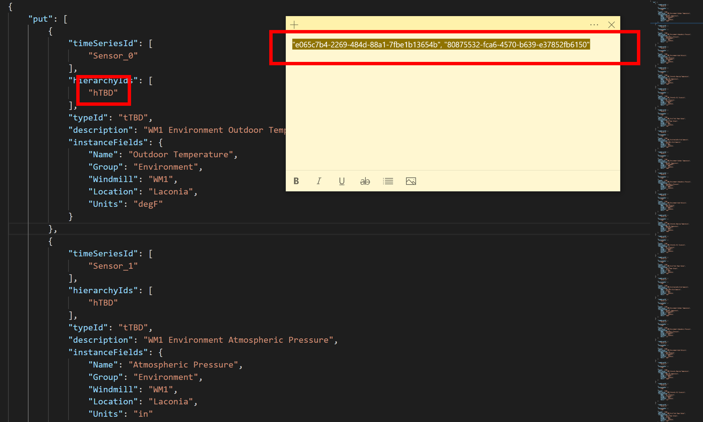

6. Save your updated file and in the explore go to the Instances tab and select Upload JSON:
\
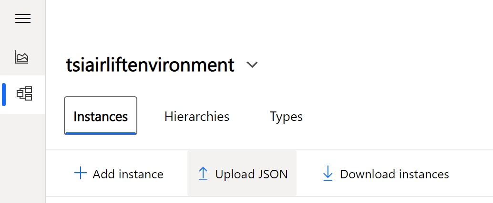

7. Choose your Instances.JSON file and click upload:
\
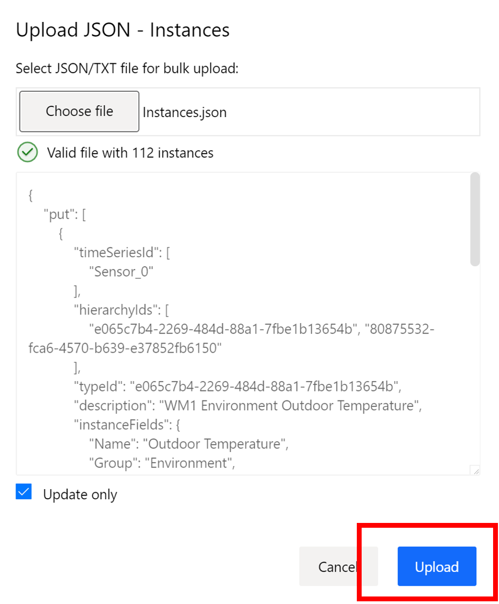

8. Your data is now modeled in both a physical and semantic hierarchy, navigate back to the analyze tab and expand each hierarchy to view the topology:
\
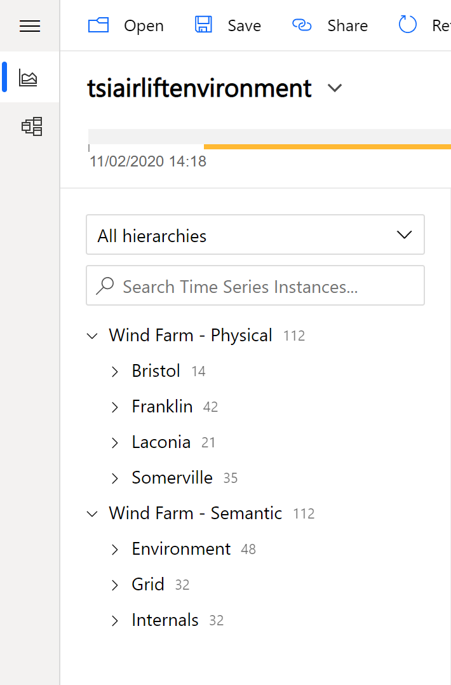

9. Continue on to the [next step](../step-05-charting/README.md) to chart and query sensor values using the TSI Explorer.

