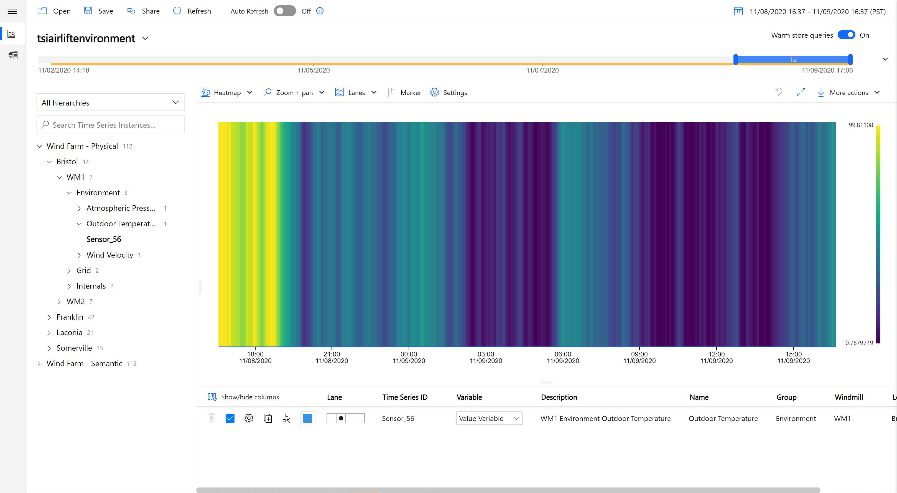

 ## Step 5: Chart and Query Data

So now that we’ve created a model for our data, we can start querying it via the TSI Explorer.

To query your data, expand your model, select an instance and click on the instance itself to see which variables are available. 

### 1. Charting Time Series
1. Use the “Wind Farm – Physical” hierarchy to select the Outdoor Temperature tag from WM1 in Bristol and show the Value Variable. 
\

2. You should see your time series displayed in the chart. Change the search span and intervals to see different results from the query using the time picker and chart settings: 
\

3. Brush over a region and click "Explore Events" to see the raw data for the selected region:
\

\

4. Create a time-shifted version of the trendline you just plotted. This will help you find any patterns across time in your data. Duplicate the charted time series and add an offset of 6 hours using advanced Chart Settings. Change the color of the time series to distinguish between the two. 
\

\

\

5. Change the chart type to view the temperature data as a heatmap:
\

\

6. Next, add another time series, the Value of Atmospheric Pressure from WM1 in Bristol. 
\

7. Use the scatter plot option to view the correlation between the Outdoor Temperature and the Atmospheric Pressure of WM1 in Bristol: 
\

\

8. Add the Status and Time Weighted Values for the Outdoor Temperature sensor of WM1 in Bristol. Brush over a region to show some common statistics for that time frame:
\

\

\

9. Add the values of Outdoor Temperature and Atmospheric Pressure from both WM1 and WM2 in Bristol. Use the Lane changers to move the time series from WM1 and WM2 into the same lanes:
\

10. To export data, use the the “More actions” button. Some options include downloading the data as a CSV and generating a query to connect to PowerBI. 
\

11. To try out the Power BI Connector, you must have the desktop version of Power BI installed. If you do, see [here](https://docs.microsoft.com/azure/time-series-insights/how-to-connect-power-bi) for steps on how to use it.

12. Continue to the [next section](../step-06-postman-apis/README.md) to query the data using the APIs.