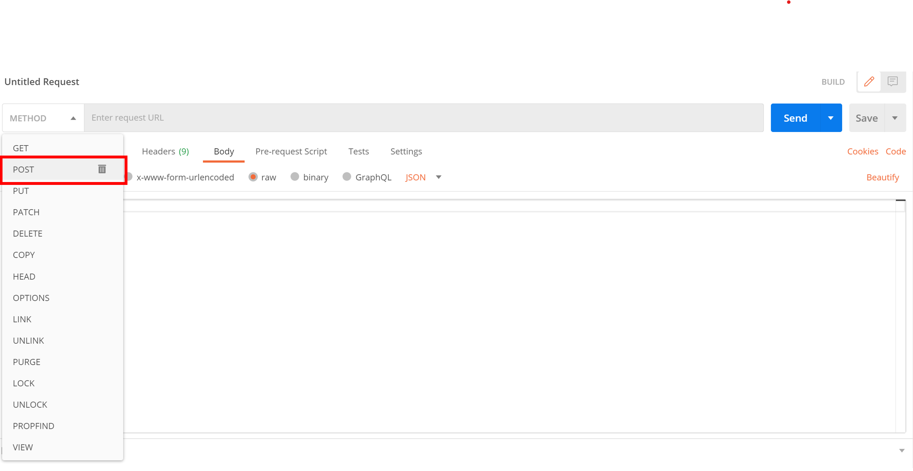
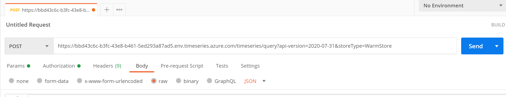
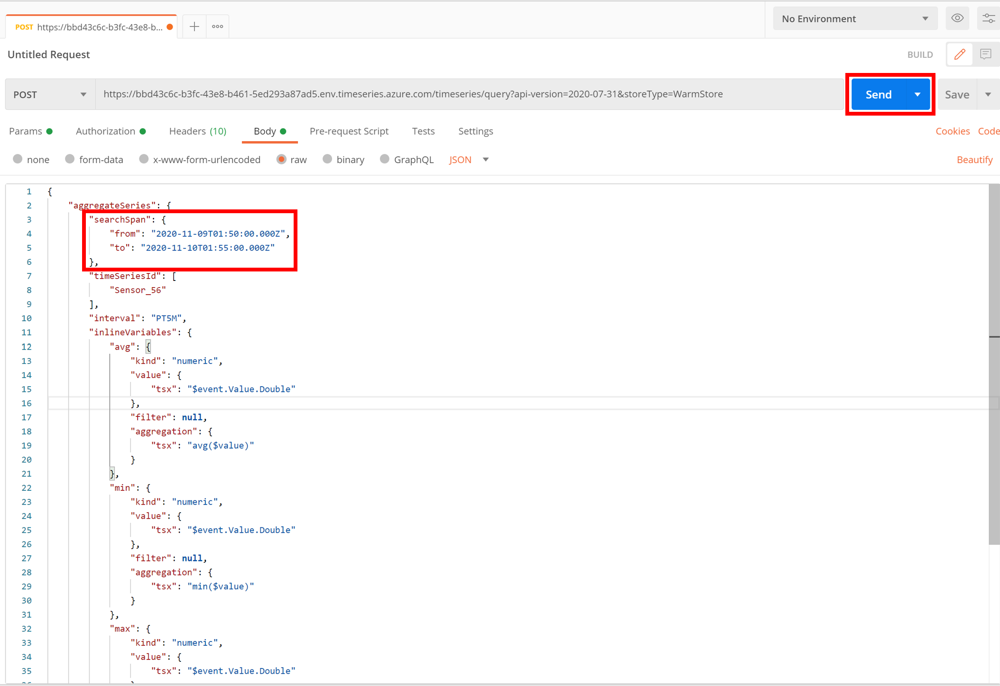

## Step 6: Query Data via APIs

Time Series Insights offers [3 query APIs](https://docs.microsoft.com/azure/time-series-insights/concepts-query-overview): GetEvents, GetSeries and AggregateSeries. 
1. GetEvents lets you query for raw events for one TSID over a selected search span. 
1. GetSeries allows you to perform calculations on the raw events and retrieve the results for one TSID over a selected search span. 
1. AggregateSeries allows you to retrieve one aggregated result per interval for one TSID over a selected search span. 

These are used by the Time Series Explorer used in the previous step to chart data. 

### 1. Set up Postman

1. If you have not already [installed Postman](https://www.postman.com/downloads/), please do so now. 
   
2. Under the Authorization tab, choose OAuth 2.0. 
\


3. Click "Get New Access Token" and fill out the form as follows: 

**Field**|**Value**
-----|-----
Name|Choose any name for your token.
Grant Type|Authorization Code
Call back URL|urn:ietf:wg:oauth:2.0:oob 
Auth URL|https://login.windows.net/microsoft.com/oauth2/authorize?resource=https://api.timeseries.azure.com/
Access Token URL|https://login.microsoftonline.com/microsoft.com/oauth2/token 
client ID| 1950a258-227b-4e31-a9cf-717495945fc2 
Client Secret| Leave blank.
Scope| Leave blank.
State| Leave blank.
Client Authentication| Send as basic auth header.

4. Click "Request Token". You may be asked to sign in to your Microsoft account. Once your identity is verified, click "Use Token".

5. Change the method type to "POST" if it's not already set.
\


6. Get your environment's FQDN value from Azure Portal. It will be a 36 char string with dashes.
\


7. Enter the following URL into the request URL box: "https://xxxxxxxx-xxxx-xxxx-xxxx-xxxxxxxxxxxx.env.timeseries.azure.com/timeseries/query?api-version=2020-07-31&storeType=WarmStore". Replace the dummy string with your environment's FQDN.
\


  > [!NOTE]
  > There is an optional [storeType parameter](https://docs.microsoft.com/rest/api/time-series-insights/dataaccessgen2/query/execute#uri-parameters) defined in the URL. You can use it to define which store (Warm or Cold) your query should run against. If you do not specify the storeType, the query will run against Cold Store.  

8. Under the Body tab, make sure you've selected "raw" and "JSON" as the input. 
\


9. We will make queries for Sensor_56. This is the Outdoor Temperature sensor from WM1 in Bristol. We will also make queries for the model APIs and the environment APIs.
\


### 2. Data Queries
- [GetEvents](../querysamples/getEvents.md) 
- 


1. You will have to edit the searchspans in the sample queries provided below. You should edit the "to" time in the search span to be today's date and "from" time to be yesterday's date (or any date range in the past for which you have data).
    


2. Copy, edit and send the queries below! If successful, you should see a 200 response code and the results populated. 
\


12. You learn that your temperature sensor has been sending faulty measurements. Each reading is about 5 degrees off. To view an "edited" version of raw events, run a GetSeries query. Enter the following JSON in the query body. You should edit the "to" time in the search span to be today's date and "from" time to be yesterday's date.

``` JSON
{
  "getSeries": {
    "timeSeriesId": [
            "Sensor_56"
        ],
        "searchSpan": {
            "from": "2020-11-09T01:50:00.000Z",
            "to": "2020-11-10T01:55:00.000Z"
        },
        "filter": {
            "tsx": "$event.Value.Double != null"
        },
    "inlineVariables": {
        "offsetTemp": {
            "kind": "numeric",
            "value": {
                "tsx": "$event.Value.Double + 5"
            },
            "filter": null,
            "aggregation": {
                "tsx": "avg($value)"
            }
        }
    },
    "projectedVariables": [
      "offsetTemp"
    ]
  }
}
``` 
  > [!NOTE]
  > There is an aggregation specified in the variables. 

10.  Enter the following JSON in the query body. You should edit the "to" time in the search span to be today's date and "from" time to be yesterday's date. 

```JSON
{
    "aggregateSeries": {
        "searchSpan": {
            "from": "2020-11-09T01:50:00.000Z",
            "to": "2020-11-10T01:55:00.000Z"
        },
        "timeSeriesId": [
            "Sensor_56"
        ],
        "interval": "PT5M",
        "inlineVariables": {
            "avgTemp": {
                "kind": "numeric",
                "value": {
                    "tsx": "$event.Value.Double"
                },
                "filter": null,
                "aggregation": {
                    "tsx": "avg($value)"
                }
            },
            "minTemp": {
                "kind": "numeric",
                "value": {
                    "tsx": "$event.Value.Double"
                },
                "filter": null,
                "aggregation": {
                    "tsx": "min($value)"
                }
            },
            "maxTemp": {
                "kind": "numeric",
                "value": {
                    "tsx": "$event.Value.Double"
                },
                "filter": null,
                "aggregation": {
                    "tsx": "max($value)"
                }
            }, 
            "twavgTemp": {
                "kind": "numeric",
                "value": {
                    "tsx": "$event.Value.Double"
                },
                "filter": null,
                "aggregation": {
                    "tsx": "twavg($value)"
                },
                "interpolation": {
                    "kind": "Step",
                }
            }
        },
        "projectedVariables": [
            "avgTemp",
            "minTemp",
            "maxTemp",
            "twavgTemp"
        ]
    }
}
```


12. Edit the variables values and aggregations to run different queries following [examples](https://docs.microsoft.com/rest/api/time-series-insights/dataaccessgen2/query/execute#examples) and [syntax documentation](https://docs.microsoft.com/rest/api/time-series-insights/reference-time-series-expression-syntax).


For information about API limits, see [here](https://docs.microsoft.com/rest/api/time-series-insights/reference-api-limits).

Continue on to section [next step](../step-07-customer-scenario-survey/) to answer the customer query scenarios survey or [see more resources to learn about TSI](../step-08-resource-links/).