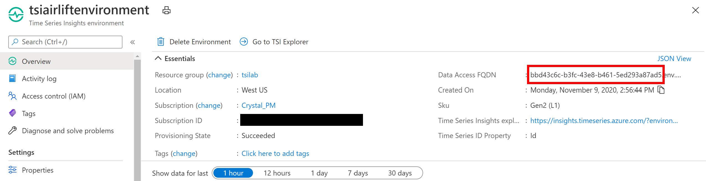

## Step 6: Query Data via APIs

Time Series Insights offers [3 query APIs](https://docs.microsoft.com/azure/time-series-insights/concepts-query-overview): GetEvents, GetSeries and AggregateSeries. 
1. GetEvents lets you query for raw events for one TSID over a selected search span. 
1. GetSeries allows you to perform calculations on the raw events and retrieve the results for one TSID over a selected search span. 
1. AggregateSeries allows you to retrieve one aggregated result per interval for one TSID over a selected search span. 

These are used by the Time Series Explorer used in the previous step to chart data. 

Time Series Insights also offers [Model APIs](https://docs.microsoft.com/azure/time-series-insights/concepts-query-overview#time-series-model-query-tsm-q-apis) and [Environment APIs](https://docs.microsoft.com/azure/time-series-insights/concepts-query-overview#environment-apis) that interact with the Time Series Model and TSI Environment, respectively. 

### 1. Set up Postman

1. If you have not already [installed Postman](https://www.postman.com/downloads/), please do so now. 
   
2. Under the Authorization tab, choose OAuth 2.0. 
\

3. Click "Get New Access Token" and fill out the form as follows: 

**Field**|**Value**
-----|-----
Name|Choose any name for your token.
Grant Type|Authorization Code
Call back URL|urn:ietf:wg:oauth:2.0:oob 
Auth URL|https://login.windows.net/microsoft.com/oauth2/authorize?resource=https://api.timeseries.azure.com/
Access Token URL|https://login.microsoftonline.com/microsoft.com/oauth2/token 
Client ID| 1950a258-227b-4e31-a9cf-717495945fc2 (previously set up app ID)
Client Secret| Leave blank.
Scope| Leave blank.
State| Leave blank.
Client Authentication| Send as basic auth header.

4. Click "Request Token". You may be asked to sign in to your Microsoft account. Once your identity is verified, click "Use Token".
 
5. Under the Body tab, make sure you've selected "raw" and "JSON" as the input. 
\

### 2. How to Run Sample Queries

1. Get your environment's FQDN value from Azure Portal. It will be a 36 char string with dashes. For some of the query URLs, you will have to replace a dummy string with your environment's FQDN.
\

2. The samples linked below will query for data from Sensor_56 (the Outdoor Temperature sensor from WM1 in Bristol). We will also make queries against the Time Series Model using the model APIs.
\

3. You will have to edit the searchspans in some of the sample queries. You should edit the "to" time in the search span to be today's date and "from" time to be yesterday's date (or any date range in the past for which you have data in your environment).

4. Copy, edit and send the queries linked below! If successful, you should see a 200 response code and the results populated. 
\

### 3. Sample Queries

1. Click any of the APIs below to see a sample. 

#### Query APIs
- [GetEvents](../querysamples/getEvents.md) 
- [GetSeries](../querysamples/getSeries.md)
- [AggregateSeries](../querysamples/aggregateSeries.md)

#### Model APIs
- [Model Settings](../querysamples/modelsettings.md)
- [Instances](../querysamples/instances.md)
- [Hierarchies](../querysamples/hierarchies.md)
- [Types](../querysamples/types.md)

5. For information about API limits, see [here](https://docs.microsoft.com/rest/api/time-series-insights/reference-api-limits).

6. Continue on to section [next step](../step-07-customer-scenario-survey/README.md) to answer the customer query scenarios survey or [see more resources to learn about TSI](../step-08-resource-links/README.md).
